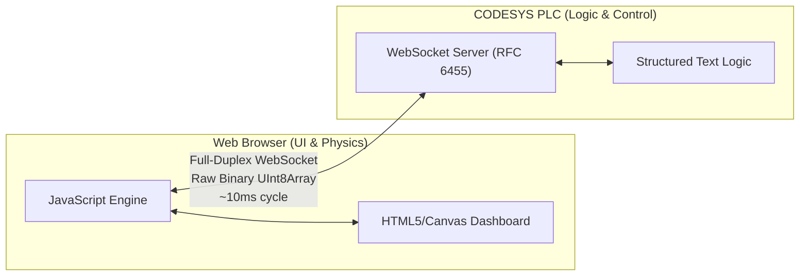

# ⚡ PLC Browser IO (Simulation Bridge)

A high-performance bridge for interconnecting Web-based process simulations with PLC (Programmable Logic Controllers) via WebSockets.

**Live Demo:** [https://arthurkax.github.io/plc-browser-io/](https://arthurkax.github.io/plc-browser-io/)

<div align="center">
  
</div>

> [!IMPORTANT]
> The Live Demo requires a **running WebSocket server** on the PLC side (using the included CODESYS project) to actually exchange data. Browsing the demo alone will show a "Connection Error" unless a local or remote PLC is listening.

## 🎯 Project Goal

The main objective is to provide a simple, lightweight, and extremely fast interface for **rapid prototyping and simulation** of industrial processes. 

**Why use this bridge?**
- **Fast & Lightweight Prototyping:** Instead of buying and setting up heavy, expensive 3D physical modeling software, you can quickly sketch the physics of your object in a web browser (using standard JavaScript, Canvas, or SVG) with zero environment overhead.
- **Effortless Debugging:** If you are developing control logic for a moderately complex object (e.g. an elevator, a sorting conveyor, or a complex PID heating tank), you can easily simulate its mechanics and sensors in the browser while the actual algorithms run on the real/virtual PLC.
- **HIL (Hardware-in-the-Loop) Testing:** Test and refine your PLC logic securely against a virtual environment before commissioning the real equipment.

### Key Components

- **Web Simulation Engine**: Vanilla JS/HTML5 for process visualization and logic.
- **Communication Layer**: RFC 6455 WebSocket Server implemented directly inside the PLC.
- **Data Exchange**: Binary-packed byte arrays for maximum efficiency and predictable latency.
- **Code Generation**: Automated generation of CODESYS/TIA Portal variable declarations (ST) from JavaScript IO definitions.

---

## 🚀 Core Concepts

### Architecture Details



### 1. The Binary "Memory Image"

Instead of high-overhead JSON or XML, data is exchanged as a raw `Uint8Array`. Both sides (JS and PLC) agree on a memory map.

- **Data Layout**: Signals are packed sequentially into bytes.
  - `Bool` -> 1 bit (packed into bytes) or 1 byte (simplified).
  - `Int/Real` -> 2/4 bytes (Little Endian).
- **JS side**: Uses standard `DataView` or specialized buffers for efficient packing.
- **PLC side**: Accesses data via pointers or overlays (`UNION` / `STRUCT` with `AT` addresses).

### 2. High-Speed Synchronization

- **Target Latency**: 10ms update rate.
- **Frequency Control**: Adjustable polling/push interval on both sides.
- **Bidirectional**: Full-duplex communication allows simultaneous reading of inputs and writing of outputs.
- **Performance**: Binary frames minimize CPU usage on the PLC side, leaving more cycles for control logic.

### 3. "JS-First" IO Declaration & ST Generation

The simulation driving the IO map approach:

1.  **Define** sensors/actuators in JavaScript (e.g., `Sim.addIO('StartButton', 'BIT')`).
2.  **Simulation logic** interacts with these variables through bitmasks or a custom `IOHandler`.
3.  **Generate** button: Produces a Structured Text (ST) `STRUCT` where bits are packed correctly:
    ```st
    TYPE ST_SimulationInputs :
    STRUCT
        xStartButton : BIT;
        xStopButton  : BIT;
        _spare1      : BIT; // Auto-aligned to byte boundary
        _spare2      : BIT;
        _spare3      : BIT;
        _spare4      : BIT;
        _spare5      : BIT;
        _spare6      : BIT;
        iSensorValue : INT; // Starts at next byte
    END_STRUCT
    END_TYPE
    ```
4.  **Copy-Paste**: Import the type into CODESYS and use it to overlay the received buffer.

---

## 🛠 Project Structure

- `/CODESYSv3`: Implementation of the WebSocket server for CODESYS (V3.5).
  - `FB_WebSocket_Server`: The main block handling handshakes and framing.
  - `GVL_WebSocket`: Global variables for communication buffers.
  - `/.project/plc-browser-io.project`: Ready-to-use sample CODESYS project binary.
- `/webpage`: The web-based frontend.
  - `index.html`: Dashboard for connection and monitoring.
  - `script.js`: WebSocket client logic and data handling.

---

## 📈 Roadmap

- [x] CODESYS V3.5 WebSocket Server (Baseline)
- [x] Basic Web Client interface
- [x] **Binary Packing Engine**: Implementation of the `BitPacked` protocol for signals.
- [x] **10ms Cycle Optimization**: Benchmarking and jitter reduction.
- [x] **ST Code Generator**: Exporting IO maps from JS to CODESYS Structured Text.
- [ ] **TIA Portal Support**: Porting the WebSocket server to Siemens S7-1500 (LHTTP).

---

## 🚦 Getting Started

1.  **PLC Setup**: Load the project from `CODESYSv3` into your CODESYS environment (Control Win V3 or hardware).
2.  **Web Client**: To use the WebUI and automatic config loading, you **must use a local web server**. Do not open the HTML file directly (`file:///`) as browsers block local JSON reads (CORS).

    **Option A: Python (Windows / Linux)**
    ```bash
    cd webpage
    # Windows:
    python -m http.server 3000
    # Linux:
    python3 -m http.server 3000
    ```

    **Option B: Node.js (Universal)**
    ```bash
    cd webpage
    npx serve -p 3000
    ```

    **Option C: Quick Start (Windows)**
    Simply double-click the `start.bat` file in the project root to open an interactive menu that finds and launches an available local server automatically!

3.  **Connect**: Navigate to `http://localhost:3000` in your browser. The UI will automatically load `simulation_project.json` and attempt to connect to the PLC.

---

## 🧪 Compatibility

The current implementation has been successfully tested on:
- **CODESYS**: V3.5 SP20 Patch 1 + (32-bit) *(CODESYS Control Win V3)*
- **Web Client**: Mozilla Firefox

---

## 👨‍💻 Development

The CODESYS source code contained in this repository is maintained in plain text (`.st` files) to allow proper version control with Git. 
This synchronization between the plaintext source tree and the included binary project file (`CODESYSv3/.project/plc-browser-io.project`) was achieved using the [cds-text-sync](https://github.com/ArthurkaX/cds-text-sync) utility!

---

_“Bridging the gap between modern web technologies and industrial automation.”_
