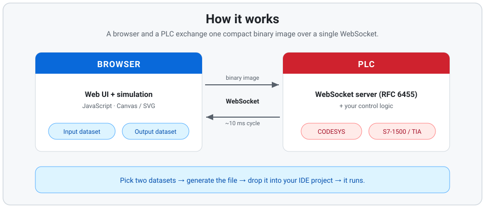
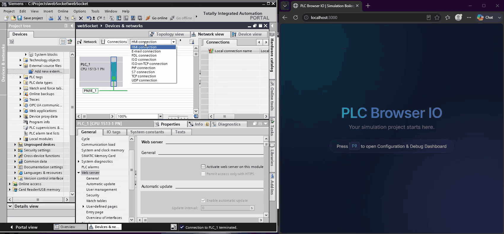

# ⚡ PLC Browser IO

[](https://github.com/ArthurkaX/plc-browser-io/stargazers)
[](https://github.com/ArthurkaX/plc-browser-io/forks)
[](https://github.com/ArthurkaX/plc-browser-io/issues)
[](https://github.com/ArthurkaX/plc-browser-io/commits/main)
[](LICENSE)

A lightweight bridge that connects a **web page** to a **PLC** over a single WebSocket — for fast prototyping, simulation, and hardware-in-the-loop testing.

**Live Demo:** [https://arthurkax.github.io/plc-browser-io/](https://arthurkax.github.io/plc-browser-io/)


> [!IMPORTANT]
> The Live Demo needs a **running WebSocket server on the PLC side** (the included CODESYS or S7-1500 project) to actually exchange data. Without a listening PLC you'll just see a "Connection Error".

---

## 💡 Why I Built This

PLC tooling gets clumsy the moment all you want to do is *prototype*. Sometimes you just need to sketch something and try it — and doing that through a watch table (VAT) or the IDE itself is painful.

This isn't a SCADA replacement, and I wouldn't sell it as one — but as a quick bench setup, in the right situation, it genuinely does the job. I built it for myself, as a template for my own tasks: when I need to test an algorithm, I throw together a small web UI (these days mostly with an LLM doing the typing) and test freely, instead of fighting VAT or the IDE.

What it really proves is this: with nothing installed beyond a PLC and a browser, you can stand up a surprisingly fast data link between the two. What you do with that link is up to your imagination.

---

## ⚙️ How It Works



You decide what to exchange — an **input dataset** and an **output dataset**. The web page generates a ready-to-import file; you drop it into your PLC project (CODESYS or TIA Portal) and it runs. Data crosses as one compact binary image over WebSocket, ~10 ms per cycle.

Think of it as a small drop-in library, not a framework: define the two datasets, import one file, go.

---

## 🟥 Two Targets: CODESYS & S7-1500

- **CODESYS V3.5** — the original target. Ready-to-use project in [`CODESYSv3/`](CODESYSv3/).
- **Siemens S7-1500** (TIA Portal V18, tested on PLCSIM Advanced V5.0) — a single import-ready `PLC_Browser_IO.scl`, generated from your dataset by `webpage/s7-1500.html`. Full guide: [`PLCSIM-Advanced-v5/README.md`](PLCSIM-Advanced-v5/README.md).

Walkthrough — adding the TCP connection by hand, importing the generated `.scl`, downloading to the CPU, and live data exchange with the browser:



---

## 🚦 Getting Started

1. **PLC side:** load the matching project — [`CODESYSv3/`](CODESYSv3/) for CODESYS, or follow [`PLCSIM-Advanced-v5/README.md`](PLCSIM-Advanced-v5/README.md) for S7-1500.
2. **Web side:** serve the `webpage/` folder from a local server. Do **not** open the HTML directly (`file:///`) — browsers block local JSON reads (CORS).

   **Python**
   ```bash
   cd webpage
   python -m http.server 3000     # Linux: python3
   ```

   **Node.js**
   ```bash
   cd webpage
   npx serve -p 3000
   ```

   **Windows quick start:** double-click `start.bat` in the project root — it finds and launches an available local server for you.

3. **Connect:** open `http://localhost:3000`. The UI auto-loads `simulation_project.json` and connects to the PLC. Open `index.html` for CODESYS or `s7-1500.html` for the Siemens generator.

---

## 🗂 Repo Layout & Docs

| Path | What's there |
|------|--------------|
| [`webpage/`](webpage/) | Web client + code generators — `index.html` (CODESYS), `s7-1500.html` (Siemens). Shared engine: `plc-core.js`. |
| [`CODESYSv3/`](CODESYSv3/) | CODESYS WebSocket-server project. ST syntax cheat-sheet: [`CODESYSv3/rules.md`](CODESYSv3/rules.md). |
| [`PLCSIM-Advanced-v5/`](PLCSIM-Advanced-v5/) | S7-1500 bridge (`PLC_Browser_IO.scl`) + [setup guide](PLCSIM-Advanced-v5/README.md). |

---

## 🧪 Compatibility

Tested on:
- **CODESYS**: V3.5 SP20 Patch 1, 32-bit (Control Win V3)
- **S7-1500**: TIA Portal V18 / PLCSIM Advanced V5.0
- **Browser**: Mozilla Firefox

---

## 📈 Roadmap

- [x] CODESYS V3.5 WebSocket server (baseline)
- [x] Web client interface
- [x] **Binary packing engine** — bit-packed signal protocol
- [x] **10 ms cycle optimization** — benchmarking and jitter reduction
- [x] **ST code generator** — export IO maps from JS to CODESYS Structured Text
- [x] **S7-1500 / TIA Portal support** — WebSocket server ported to Siemens (TIA V18 / PLCSIM Advanced), with a web generator that emits a complete import-ready `PLC_Browser_IO.scl`

---

## 👨‍💻 Development

The CODESYS source is kept as plain text (`.st`) for proper Git version control. Syncing between the plaintext tree and the binary project file (`CODESYSv3/.project/plc-browser-io.project`) is done with the [cds-text-sync](https://github.com/ArthurkaX/cds-text-sync) utility.

---

_"Bridging the gap between modern web technologies and industrial automation."_
